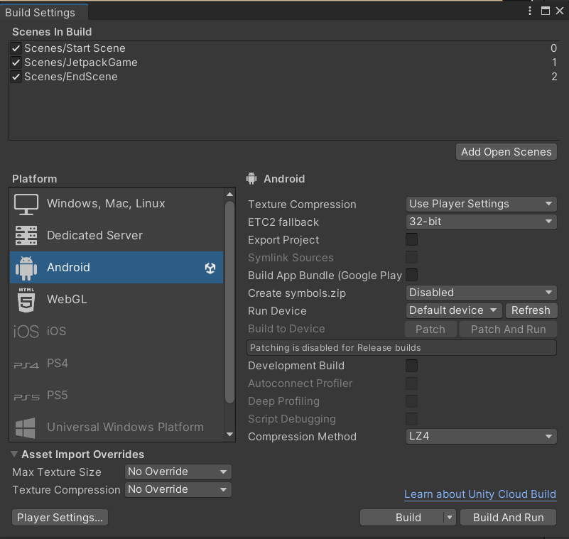

# PRU211m - Jetpack-game-2D - Unity

## Hướng dẫn sử dụng git cho repo chung

- **Clone this repo** --> `git clone https://github.com/minhbebong/Jetpack-game-2D.git`
- **Kiểm tra trạng thái file/folder sau khi code** --> `git status`
- **Add các file/folder đã thay đổi** --> `git add .` hoặc `git add <folder/file>`
- **Tạo commit sau khi add file/folder vào stage** --> `git commit -m "<message>"`
- _Lưu ý khi tạo commit: message phải có commit convension và thông tin tổng quát về commit_
  - VD: _script: add monster moving_
- **Tạo nhánh mới (dành cho lần đầu trước khi push code, các lần sau không cần)** --> `git checkout -b <nhánh tạo>`
- **Di chuyển sang các nhánh khác** --> `git checkout <tên nhánh>`
- **Kéo code từ trên github về** --> `git pull`
- **Đẩy code lên nhánh (dành cho lần đầu push lên nhánh mới)** --> `git push origin -u <tên nhánh>`
- **Đẩy code lên nhánh (dành cho các lần sau)** --> `git push`
- _Phải xử lý các conflict trước khi push code -> Click to <kbd>resolve conflict</kbd> in vscode when it notify conflict code._
- _Lưu ý về merge code: các thành viên phải tạo nhánh riêng cho cá nhân, sau khi push code -> tạo pull request về nhánh develop; nếu có lỗi gì về git, báo về leader để xử lý._

## Hướng dẫn sử dụng các folder/file trong dự án chung

**1. Các quy định về folders/files chung cần lưu ý**

- Thư mục `Animations`:
  - Các file _Animation_ phải được wrap bởi thư mục cha trùng tên với character hiện tại.
- Thư mục `Prefabs`:
  - Đây là thư mục chứa các models/sprites được dụng sẵn.
  - _Lưu ý: như ở mục animations, các file prefabs được đặt bên trong thư mục cha._
- Thư mục `Scenes`:
  - Chứa các scenes cho 1 màn chơi.
- Thư mục `Scripts`:
  - Chứa các file .cs script. Tương tác với GameObject.
  - _Lưu ý: như ở mục animations, các file prefabs được đặt bên trong thư mục cha._
- File `Sprites`:
  - Chứa các hoạt ảnh tĩnh của character/map.
  - _Lưu ý: như ở mục animations, các file prefabs được đặt bên trong thư mục cha._
- Folder `Audio`:
  - Chứa các file âm thanh của game .

**2. Quy định việc tạo các folder/file mới**

- Tại project chung, có thể tạo thêm folders khác như _Models, Audio, Cameras..._ để hỗ trợ.
- _Lưu ý: không tuỳ ý tạo các file đơn lẻ, các files phải được wrap lại bên trong 1 folder cụ thể._

## Hướng dẫn build game về máy android.

**B1. Vào phần file chọn Build Settings**
</img>

**B2. Chọn Player Seetings**
</img>

**B3. Tạo Keystore mới . Chọn Publishing Settings -> KeystoreManager -> Key store -> Create new**
</img>

**B4. Chọn Resolution and Prentation**
</img>

**B5. Nhập lại password vừa tạo vào Publishing Settings**
</img>

**B6. Ở màn Build Setting. Sắp xếp lại Scenes in Build . Chọn nút Build ở phía dưới bên phải**
</img>

**Tài liệu tham khảo**

- [Cách tạo Android Keystore Manager](https://docs.unity3d.com/2020.2/Documentation/Manual/android-keystore-manager.html)

-[Các bướcBUILD GAME UNITY-ANDROID](https://unity3d1.blogspot.com/2015/07/huong-dan-build-game-unity-ra-android.html)
